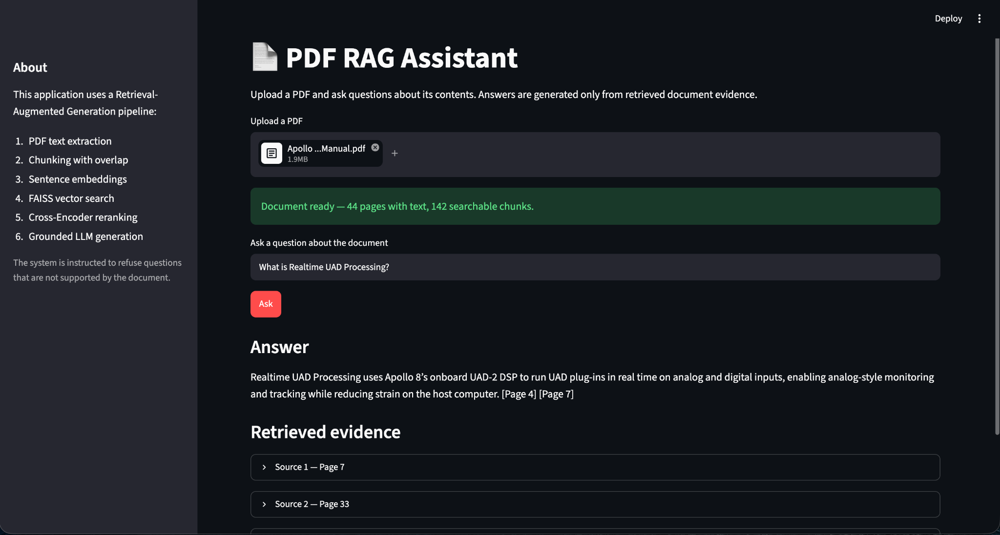
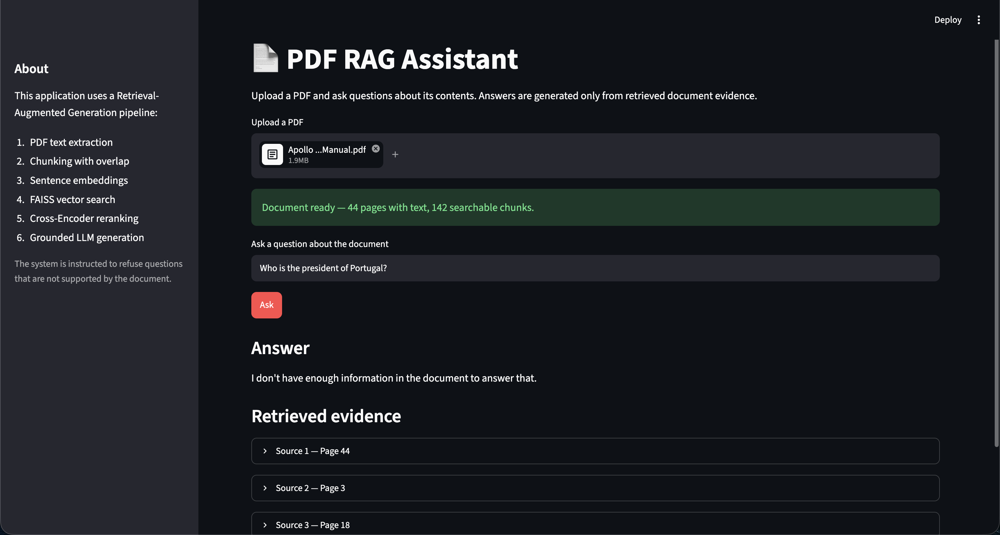

# PDF RAG Assistant

An end-to-end Retrieval-Augmented Generation (RAG) application that lets users upload a PDF and ask questions grounded in the document.

The system combines semantic embeddings, FAISS vector search, Cross-Encoder reranking and LLM generation to produce answers with page citations and retrieved evidence.

## Project Overview

Large documents can be difficult to search manually.

This project implements a RAG pipeline that:

1. extracts text from uploaded PDFs
2. splits documents into overlapping chunks
3. converts chunks into semantic embeddings
4. retrieves relevant passages using FAISS
5. reranks candidates using a Cross-Encoder
6. generates answers using only retrieved evidence
7. cites the relevant PDF pages
8. refuses questions that are unsupported by the document

## Architecture

```text
PDF
 ↓
Text extraction
 ↓
Chunking with overlap
 ↓
Sentence embeddings
 ↓
FAISS vector search
 ↓
Top-k candidates
 ↓
Cross-Encoder reranking
 ↓
Grounded LLM generation
 ↓
Answer + page citations + retrieved evidence
```

## Retrieval Pipeline

### PDF Processing

PDF text is extracted page-by-page using `pypdf`.

Each chunk preserves:

- chunk ID
- page number
- text content

The chunking strategy uses overlap so that relevant context is less likely to be lost at chunk boundaries.

### Embeddings

The project uses:

```text
sentence-transformers/paraphrase-multilingual-MiniLM-L12-v2
```

Each chunk is represented as a semantic vector.

Embeddings are normalized before indexing.

### Vector Search

FAISS is used for fast similarity search.

The index uses inner-product similarity over normalized embeddings, which corresponds to cosine similarity.

### Reranking

The initial FAISS candidates are reranked using:

```text
cross-encoder/ms-marco-MiniLM-L-6-v2
```

Unlike embedding similarity, the Cross-Encoder evaluates the query and candidate passage together.

This improves the final ranking of retrieved evidence.

### Grounded Generation

The top retrieved passages are supplied to the LLM as context.

The generation layer is instructed to:

- answer only from retrieved document evidence
- avoid outside knowledge
- include page citations
- refuse unsupported questions
- avoid inventing citations

## Retrieval Evaluation

The retrieval pipeline was evaluated on NASA's *Aeronautics: An Educator's Guide*.

Five document-grounded questions were tested:

```text
What causes lift on an airplane wing?
What is thrust?
How does air pressure affect flight?
What is drag?
What is a glider?
```

Result:

```text
Retrieval Hit@3: 5/5
Retrieval accuracy: 100.0%
```

This is a small project-specific evaluation and should not be interpreted as a general benchmark of RAG performance.

## Cross-Document Validation

The pipeline was also tested on a second, previously unseen technical PDF: an Apollo audio-interface manual.

The system successfully:

- processed the new document without retraining
- retrieved relevant passages
- answered technical questions about Realtime UAD Processing
- generated page citations
- refused questions unrelated to the uploaded document

This confirmed that the pipeline was not specific to the NASA evaluation document.

## Hallucination Control

A key requirement of the project is refusing unsupported questions.

For example, when using the NASA aeronautics document:

```text
Question:
Who won the 2022 FIFA World Cup?
```

The system returns:

```text
I don't have enough information in the document to answer that.
```

This helps reduce hallucination by requiring retrieved evidence before answering.

## Streamlit Application

The interface allows users to:

- upload a PDF
- automatically process the document
- ask natural-language questions
- receive grounded answers
- see page citations
- inspect the top retrieved passages
- inspect semantic and reranker scores

## Screenshots

### Grounded answer



### Unsupported question



## Project Structure

```text
rag-pdf-chatbot/
├── app/
│   └── app.py
├── src/
│   ├── __init__.py
│   ├── pdf_processing.py
│   ├── embeddings.py
│   ├── retrieval.py
│   └── generation.py
├── tests/
│   ├── __init__.py
│   ├── test_pdf_processing.py
│   └── evaluate_retrieval.py
├── data/
│   └── pdfs/
│       └── .gitkeep
├── images/
│   ├── grounded-answer.png
│   └── unsupported-question.png
├── .env.example
├── .gitignore
├── LICENSE
├── README.md
└── requirements.txt
```

## Run Locally

Clone the repository.

Create and activate a virtual environment.

Install dependencies:

```bash
pip install -r requirements.txt
```

Create a `.env` file:

```text
OPENAI_API_KEY=your_api_key_here
```

Run the application:

```bash
streamlit run app/app.py
```

Upload a text-based PDF and begin asking questions.

Recommended Python version: **3.12**.

## Technologies

- Python
- Streamlit
- OpenAI API
- Sentence Transformers
- Cross-Encoder reranking
- FAISS
- pypdf
- NumPy
- pytest

## Testing

Unit tests:

```bash
python -m pytest tests/test_pdf_processing.py -v
```

Retrieval evaluation:

```bash
python -m tests.evaluate_retrieval
```

Observed retrieval result:

```text
Hit@3: 5/5
Accuracy: 100.0%
```

## Limitations

- Only text-based PDFs are supported; scanned PDFs would require OCR.
- Retrieval quality depends on document structure and wording.
- The retrieval evaluation currently contains only five manually selected questions.
- Page extraction quality depends on the internal structure of the PDF.
- Reranking and embedding models consume additional memory.
- LLM generation requires an API connection and may incur usage costs.
- Retrieved context reduces hallucination risk but does not guarantee perfect factual accuracy.
- Very large PDFs would benefit from persistent vector storage and more scalable indexing.

## Future Improvements

- OCR support for scanned documents
- persistent vector database
- multi-document collections
- conversational memory
- automatic RAG evaluation
- citation verification
- configurable chunking strategies
- asynchronous document processing
- support for additional file types
- Docker deployment
- CI/CD
- monitoring and usage analytics

## Security

API keys are never stored in the repository.

Local development uses:

```text
.env
```

Production deployment should use the hosting platform's secrets management.

Uploaded PDFs are excluded from Git through `.gitignore`.

## License

Project code is released under the MIT License.
